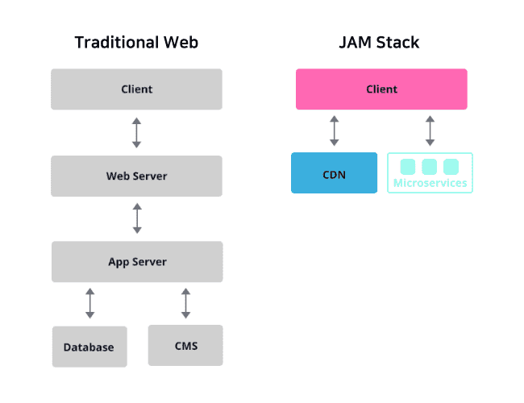
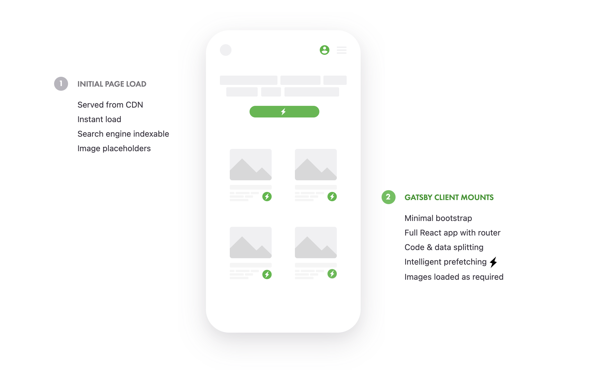

최근 정적 사이트 프로젝트를 진행하기 위해서 자료를 찾아보는 도중 최근 프론트엔드 시장에서 빠르게 발전하고 있는 Gatsby에 대해 알게 되었습니다. Gatsby는 Jamstack 구조를 활용하여 빠르고 안전한 정적 사이트를 만들어 낼 수 있습니다. 저희 팀은 이런 Gatsby의 특징에 매료되어 프로젝트에 Gatsby를 사용하기로 결심하였죠. 아무런 지식도 없이 운영 계획이 있는 프로젝트를 진행하기는 부담이 되었고 때문에 간단하게 저만의 기술 블로그를 만들어 보며 Gatsby에 대해 알아가는 시간을 가져 보았습니다.

대책없이 시작한 기술 블로그 프로젝트, 당연히 난관에 봉착하였습니다. 새로운 기술을 배울 때마다 느끼는, 뭔가 놓치고 있지는 않은가에 대한 생각이 들기 시작한 것입니다. 타이핑 속도가 현저히 낮아졌다고 생각한 지금이 바로 Gatsby의 내부 동작 과정을 이해하기에 가장 적합한 시기라는 생각이 들었습니다. (제가 이 글을 쓰고 있는 이유이기도 하죠)

그럼 앞으로 Gatsby 공식 문서와 여러 자료들을 찾아보고 제 나름대로 정리해보며 Gatsby를 좀 더 잘 이해해보도록 하겠습니다! 😆

 

---

## 왜 블로그를 만드는데 Gatsby를 쓰려고 하나요?

저는 무언가 결정을 할 때, 스스로에게 '왜'라는 질문을 던지는 것이 참 중요하다고 생각합니다. 아무 이유없이 결정하는 수동적인 태도가 싫기도 하고 무엇보다 '왜'라는 질문을 던지므로써 목표의식이 더 뚜렷해지기 때문일 것입니다. 오늘은 제가 Gatsby를 쓰려고 결심한 이유와 함께 중요 개념들을 체크하는 시간을 가져보도록 하겠습니다.

### React 기반 프레임워크

저는 React를 이용해서 프로젝트를 진행해왔기 때문에 React에 더 익숙합니다. React 기반 정적 사이트 생성기(SSG) 중에는 Next.js와 Gatsby가 있는데 부끄러운 말이지만 당시 저는 아직 둘 중 어느 것도 사용해보지 못한 상태였기 때문에 플러그인이나 자료가 조금 더 많다고 느낀 Gatsby를 선택하였습니다. 참고로 React에 Gatsby가 있다면 Vue에는 VuePress가 있습니다.

### Gatsby는 Jamstack

제가 만들 블로그는 정적 사이트인 만큼 더 빠른 속도를 원했습니다. 이러한 이유로 저는 최신 아키텍처인 Jamstack로 웹을 구성하고자 했고, Gatsby는 이를 편하게 이뤄줄 수 있었습니다.

> #### Jamstack이란?
>
> Jamstack은 Javascript, API, Markup로만 이뤄진 최신 웹 구성 방식을 말합니다. Jamstack으로 구성된 웹은 기존보더 더 적은 계층으로 구성되어 빠르고, 사전에 Pre-rendering 되어서 서버 측 공격의 위험이 없어 더 안전합니다. Jamstack을 사용하면 마크업 요소들과 다양한 API를 이용하여 사전에 만들어 놓은 페이지를 CDN을 통해 열람할 수 있습니다. 아래의 그림은 Jamstack의 구조를 이해하는 것에 도움이 되는 자료입니다.

 

아래 참고 자료는 Jamstack 프레임워크들의 다운로드 횟수를 비교해놓은 자료입니다. 앞서 언급한 Next.js도 있군요. 앞도적인 차이이지만 Next.js는 Server Side Rendering(SSR)을 위해 사용되기도 하니까요. 당연한 결과라고 생각합니다.

 

### Gatsby와 검색 엔진 최적화(SEO)

브라우저의 성능이 점점 좋아지며 Single Page Application(SPA) 형태의 웹 사이트가 유행하기 시작하던 시점에 React, Vue같은 Client Side Rendering(CSR) 방식의 프레임워크들이 등장하였습니다. 하지만 CSR의 한계점으로 SEO가 자주 거론 되었고 이를 해결하기 위한 노력들이 필요했습니다.

구글봇은 CSR의 자바스크립트를 이해할수 있기 때문에 HTML에 지극히 적은 정보가 들어있는 것은 둘째치더라도, CSR은 첫 의미있는 페이지(First meaningful paint)를 보기 까지 너무 오랜 시간이 걸리는 것이 문제였습니다. 위 문제점들을 해결하기 위해 CSR의 Next.js나 Nuxt.js 같은 SSR을 도와주는 프레임워크들이 등장하였고 인기 비결이기도 합니다.

설명이 길었지만 결국 Gatsby는 Build-time에 정적 HTML을 만들어 내기 때문에 첫 화면에 **의미있는 HTML을 빠른 속도**로 로드할 수 있기 때문에 SEO에 유리한 것입니다!

---

## Source

https://www.gatsbyjs.com/ 
https://jamstack.org/what-is-jamstack/ 
https://www.inflearn.com/course/gatsby-%EA%B8%B0%EC%88%A0%EB%B8%94%EB%A1%9C%EA%B7%B8/lecture/75995?tab=curriculum 
https://minsoftk.tistory.com/68 
https://pks2974.medium.com/jam-stack-%EA%B0%9C%EB%85%90-%EC%A0%95%EB%A6%AC%ED%95%98%EA%B8%B0-17dd5c34edf7 
